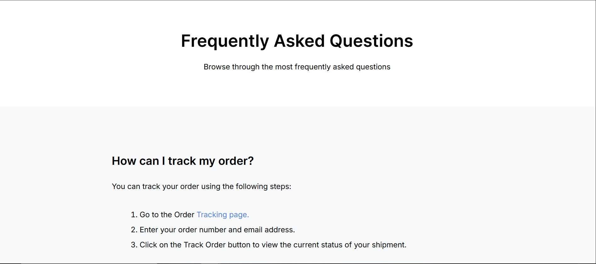

# FAQ

> Frequently Asked Questions (FAQ)

This is a simple FAQ webpage that displays frequently asked questions and their corresponding answers.

## Built With
- HTML5
- CSS3
- Media Queries

## Live Demo Link 
[FAQ](https://faq-psi-two.vercel.app/)

## Author 

👤 **Emmanuelle Kamwa**

-   Github: [@emmanuellekamwa](https://github.com/emmanuellekamwa)
-   Twitter: [@AlixKamwa](https://twitter.com/AlixKamwa)
-   Linkedin: [emmanuelle-kamwa-86145a1a4](https://www.linkedin.com/in/emmanuelle-kamwa-86145a1a4/)

🤝 Contributing
Contributions, issues and feature requests are welcome!

Feel free to check the issues page.

# Show Some Support

Give a ⭐ if you've liked my project and your comments are highly accepted.

## License

This project is MIT licensed.